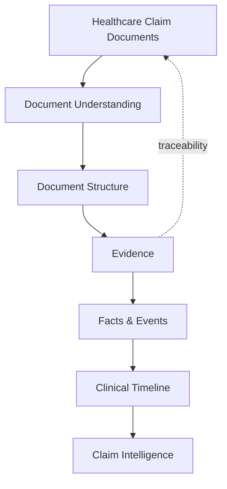

# GOUTAMIND Document Intelligence

> **From healthcare documents to evidence-linked claim intelligence.**

**GOUTAMIND Document Intelligence** is an evidence-driven document intelligence project for understanding heterogeneous healthcare claim documents.

Healthcare claims rarely arrive as clean, structured data. A single claim may contain emergency records, inpatient notes, diagnostic reports, medication records, administrative documents, billing information, and claim outputs — often combined into heterogeneous PDF bundles from different hospitals.

The challenge is not simply extracting text from PDFs.

The challenge is to understand **what each document represents, where information came from, how facts relate to clinical events, and how every derived insight can remain traceable to its source evidence.**

---

## The Problem

A healthcare claim document bundle may contain:

- multiple logical documents inside a single PDF;
- different document layouts between hospitals;
- scanned and digitally generated pages;
- tables, forms, and image-based content;
- clinical and administrative information mixed together;
- repeated information with different levels of temporal precision;
- documents whose physical order does not represent clinical event order.

Therefore:

> **PDF extraction is not the same as document understanding.**

A reliable intelligence layer needs to preserve the relationship between the original document and every piece of information derived from it.

---

## The Approach

This project follows an **evidence-first architecture**.



The long-term architecture is:

```text
PDF / Document Bundle
        │
        ▼
Document Understanding
        │
        ▼
Canonical Clinical Claim
        │
        ▼
Evidence
        │
        ▼
Clinical Timeline
        │
        ▼
Narrative
        │
        ▼
Claim Intelligence
```

The current implementation focuses on establishing the foundations of this architecture before introducing more advanced intelligence layers.

---

## Core Semantic Model

The project separates the physical document structure from the semantic information derived from it.

```text
Claim Document Bundle
        │
        ├── Document
        │     ├── Section
        │     │     └── Chunk
        │     │
        │     └── Evidence
        │
        └── Facts / Events
                │
                └── Evidence
```

The goal is not to force every hospital into the same document layout.

Instead:

> **Normalize meaning, not layout.**

Different hospitals may produce very different documents while representing the same underlying clinical or administrative concepts.

---

## Evidence First

Evidence is treated as a first-class part of the system.

Every important derived fact should be traceable back to its source.

```text
Source Document
      │
      ▼
Source Page
      │
      ▼
Document Element
      │
      ▼
Evidence
      │
      ▼
Fact / Event
      │
      ▼
Clinical Interpretation
```

This allows downstream users to ask:

- Where did this information come from?
- Which document contains it?
- Which page contains it?
- Was it directly extracted or derived?
- What level of temporal precision was available?
- Is the information missing, unknown, or explicitly documented?

The system therefore distinguishes between:

- `SOURCE_FACT`
- `DERIVED_FACT`
- `INFERRED_FACT`
- `MODEL_OUTPUT`

AI or machine learning may assist interpretation, but the model is not treated as the source of truth.

> **The source is the evidence.  
> The model interprets the evidence.  
> The system preserves the distinction.**

---

## Clinical Time Is Not Document Order

One of the fundamental design principles is:

> **Document order is not necessarily clinical event order.**

A PDF may contain documents arranged according to administrative or scanning order rather than the actual patient journey.

The project therefore preserves temporal information with explicit precision, including:

- exact datetime;
- date;
- month;
- year;
- unknown.

The system should not invent temporal precision that does not exist in the source.

---

## Current Capabilities

The current vertical slice establishes the first layer of the document intelligence pipeline.

Current foundations include:

- PDF document reading;
- page representation;
- document segmentation;
- document taxonomy;
- section and chunk representation;
- deterministic fact extraction;
- deterministic event extraction;
- evidence representation;
- evidence provenance;
- temporal precision preservation;
- explicit missingness semantics;
- page-to-document assignment provenance.

The current implementation deliberately uses deterministic methods for the foundational layer.

---

## Current Focus

The next architectural challenge is **layout-aware document understanding**.

Early experiments showed that healthcare documents cannot always be reliably understood from plain text order alone.

Important signals include:

- page counters;
- document titles and markers;
- headers and footers;
- page layout;
- coordinates and bounding boxes;
- columns and regions;
- label/value relationships;
- continuation pages;
- scanned/image pages;
- document boundary signals.

The project is therefore investigating how physical layout can be represented before moving further into canonical clinical extraction and downstream intelligence.

---

## Architecture Roadmap

```text
PHASE 1
Physical Document Understanding
        │
        ▼
PHASE 2
Layout-Aware Document Understanding
        │
        ▼
PHASE 3
Canonical Clinical Claim
        │
        ▼
PHASE 4
Clinical Timeline
        │
        ▼
PHASE 5
Evidence-Linked Narrative
        │
        ▼
PHASE 6
Claim Intelligence
```

Each phase is intended to be **evidence-driven and architecture-reviewed** before the next layer is introduced.

---

## Design Principles

### 1. Evidence First

Important information must remain traceable to its source.

### 2. Preserve Before Normalizing

Preserve the source representation before deriving normalized meaning.

### 3. Normalize Meaning, Not Layout

Hospital-specific document layouts should not define the semantic model.

### 4. Uncertainty Is Data

Unknown, missing, ambiguous, and inferred information must remain explicit.

### 5. Clinical Time Is Independent of Document Order

Page order and clinical event order are different concepts.

### 6. Human Reviewability

Derived information should remain understandable and auditable by human reviewers.

### 7. AI Is Downstream of Evidence

Advanced AI, machine learning, or LLM-based capabilities should operate on structured and traceable evidence rather than replacing the evidence layer.

---

## What This Project Is Not

This repository is currently **not**:

- a production claim verification system;
- a fraud detection engine;
- a clinical decision support system;
- an LLM chatbot;
- a RAG application;
- a production OCR platform;
- a replacement for human claim reviewers.

These may become downstream applications of the document intelligence layer, but they are outside the current scope.

---

## Project Status

**Early Architecture / First Vertical Slice**

The project is intentionally being developed incrementally.

The current priority is not to add more AI capabilities as quickly as possible, but to establish a reliable foundation where:

```text
Document
   ↓
Evidence
   ↓
Fact / Event
   ↓
Interpretation
```

remains traceable and reviewable at every stage.

---

## Quick start

Requires Python 3.12+.

```bash
python -m venv .venv && source .venv/bin/activate   # Windows: .venv\Scripts\activate
pip install -e ".[dev]"

python -m pytest

python -m pipeline.run examples/golden_claim/synthetic_claim_bundle.pdf
```

The run writes a JSON bundle, a human-readable inspection report, and a page-assignment diagnostic to `outputs/` (git-ignored).

## Private healthcare claim documents

Real claim bundles can contain sensitive patient information and must never be committed to the repository.

Private samples should remain outside Git tracking, for example in `samples_private/`. Use `--no-source-text` when an inspection report must be shared for review.

The committed golden example uses synthetic data.

---

## Repository Structure

```text
goutamind-document-intelligence/
│
├── app/
│   ├── document/
│   ├── extraction/
│   ├── evidence/
│   ├── timeline/
│   └── intelligence/
│
├── docs/
│   ├── ARCHITECTURE.md
│   ├── DATA_MODEL.md
│   ├── EVIDENCE_LINEAGE.md
│   ├── DOCUMENT_TAXONOMY.md
│   ├── PROJECT_IDENTITY.md
│   ├── ROADMAP.md
│   └── findings/
│
├── examples/
├── schemas/
├── scripts/
├── tests/
│
├── README.md
├── LICENSE
└── pyproject.toml
```

---

## Documentation

| Document | Purpose |
|---|---|
| `ARCHITECTURE.md` | System architecture and design decisions |
| `DATA_MODEL.md` | Core semantic data model |
| `EVIDENCE_LINEAGE.md` | Evidence and provenance model |
| `DOCUMENT_TAXONOMY.md` | Healthcare document taxonomy |
| `PROJECT_IDENTITY.md` | Project identity and scope |
| `ROADMAP.md` | Development roadmap |
| `findings/` | Findings from document experiments and architectural investigations |

---

## Project Philosophy

Healthcare document intelligence should not begin with:

> **"What can AI generate from this document?"**

It should begin with:

> **"What evidence exists, where did it come from, and what can we reliably derive from it?"**

That principle defines the foundation of this project.

---

## Maintainer

**Dody Goutama**

**GOUTAMIND**
